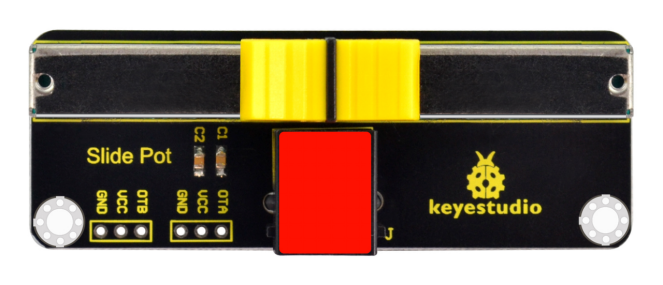
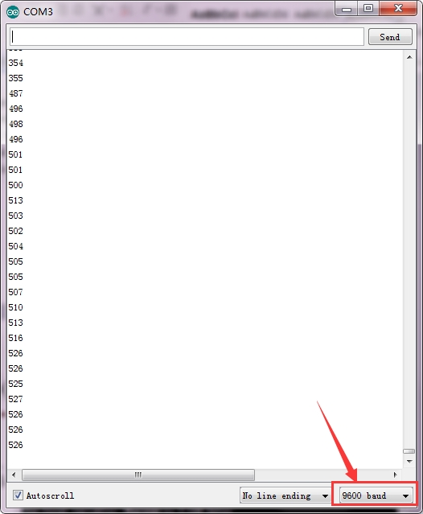

# KS0373 EASY plug Slide Potentiometer



## 1. Introduction

The EASY plug slide potentiometer uses high-quality sliding appliances for stable and reliable performance. It is a dual analog output that outputs a 0-VCC analog voltage signal.

The module pins are extended into Registered jack, so you can easily connect it to EASY Plug control board using a RJ11 cable.

There are 6 pad interfaces on the module. So you can solder two 3pin headers with a pitch of 2.54mm on the module.

It can be used to connect with other MCUs. The signal terminal outputs two analog values. The sum of the two analog values is 1023.

This module should be used together with EASY plug control board.

**Special Note:**

The sensor/module is equipped with the RJ11 6P6C interface, compatible with our keyestudio EASY plug Control Board with RJ11 6P6C interface.

If you have the control board of other brands, it is also equipped with the RJ11 6P6C interface but has different internal line sequence, can’t be used compatibly with our sensor/module.

## 2. Parameters

- Operating Voltage: DC 3.3V-5V
- Resistance: 5K
- Port: analog quantity
- Property: ROHS

## 3. Technical Details

- Dimensions: 28mm * 76.7mm * 31.3mm
- Weight: 17g

## 4. Connect It Up

Connect the EASY Plug Slide Potentiometer to control board using an RJ11 cable. Then connect the control board to your PC with a USB cable.


## 5. Upload the Code

Download code : [Code](./Code.7z)

```c
void setup() 
{
  // initialize serial communication at 9600 bits per second:
  Serial.begin(9600);
}

// the loop routine runs over and over again forever:
void loop() 
{
  // read the input on analog pin 0:
  int sensorValue = analogRead(A0);
  // print out the value you read:
  Serial.println(sensorValue);
  delay(1); // delay in between reads for stability
}
```

## 6. Result

After uploading the code, open the serial monitor and set the baud rate to 9600, you should be able to see the analog value of analog pin A0. If slide the slider, the value will change within the range of 0-1023. 

